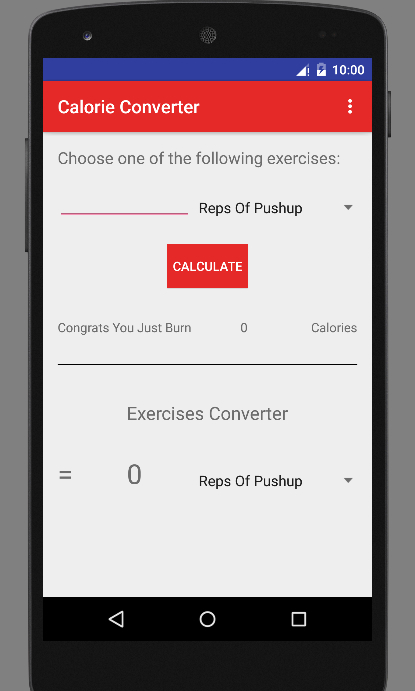
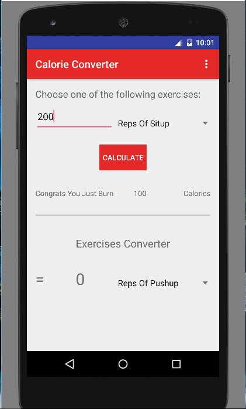
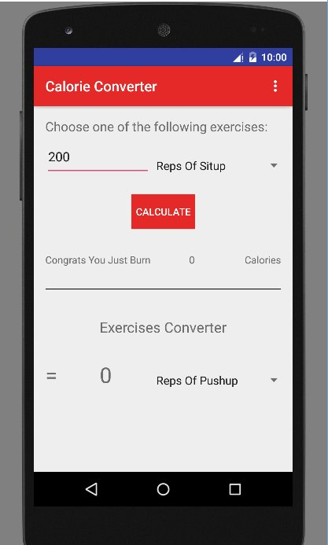
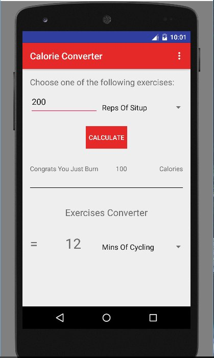
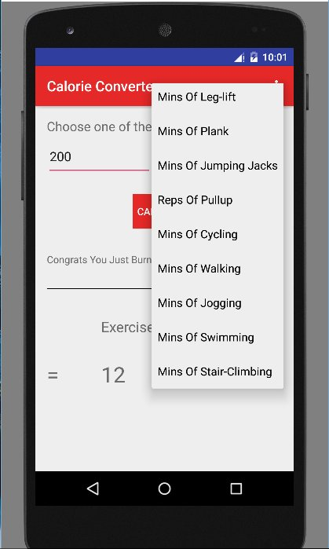

# PROG 01: Crunch Time

There are 2 main functions in this app:
1. Calculate calorie burned according to the amount of exercise done
2. Amount of exercise to be done for other type of exercises.

Let say we pick 200 situps . You will burn 100 calories.
And, when you do calorie converter, to burn 100 calories you can see that
you will need to do 12 mins of Cycling.

## Authors

Nicholas Latief ([nicholasal@berkeley.edu](mailto:nicholasal@berkeley.edu))

## Demo Video

https://vimeo.com/154458193

## Screenshots

